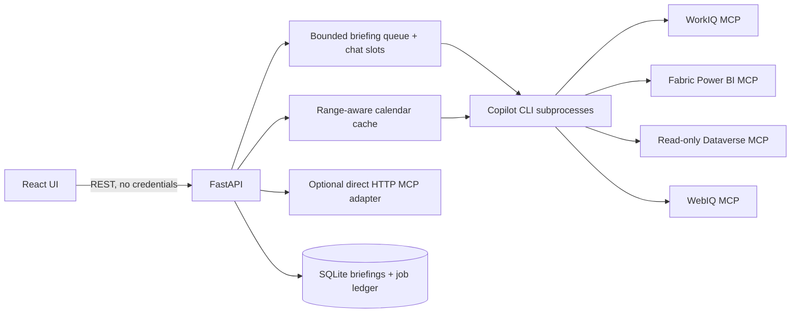

# Architecture

FastAPI is the browser credential boundary. Copilot CLI is the main agent/MCP host and owns its
delegated authentication. Both briefing and chat use the same configured working directory and
MCP config. Only selected read tools are exposed to the model, including a bounded Fabric tool
list; arbitrary shell, file writes, messages, and CRM writes are not exposed.

The calendar connector retrieves date shards, tracks coverage separately from event counts, and
atomically persists real data. A successful empty shard removes obsolete cached entries; a failed
shard cannot erase the last known data. In-flight sync is coalesced.
Calendar reads use Graph's `webLink` property for original Outlook links. CLI reads retrieve
participants separately so a large invitation list cannot truncate the entire calendar day;
unavailable participant metadata is explicitly flagged rather than fabricated.

Workers capture the meeting input before queueing so navigation cannot invalidate an active job.
The job ledger survives restarts; interrupted work is surfaced as failed and can be retried without
overwriting its previous briefing. Subprocess deadlines and shutdown clean up child processes.
Validated briefing versions include an input fingerprint for detecting changed meeting metadata.

Evidence IDs are validated against supplied sources and unsafe URLs are removed on ingestion and
when loading historical records. Confidence remains a model estimate, not a calibrated probability
or independent proof that a claim is true. CRM proposals never confer write authorization.
